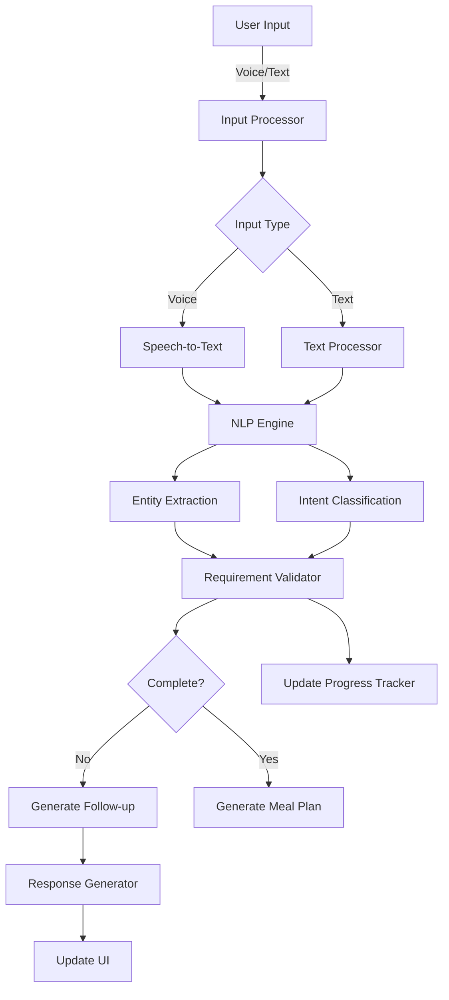

# Product Requirements Document: Enhanced Conversational AI Chatbot

## Executive Summary

This PRD outlines the transformation of ChefsCart's current step-by-step chat wizard into a natural, conversational AI experience that supports free-form text input, voice interactions, and intelligent data extraction while maintaining the efficiency of guided selections where appropriate.

## 1. Problem Statement

### Current State Issues
- **Rigid Flow**: Users are forced through a predefined 10-step wizard with limited flexibility
- **Form-like Experience**: Each step feels like filling out a form field rather than having a conversation
- **No Voice Support**: Users must type all responses, limiting accessibility and convenience
- **Limited Context Understanding**: Cannot process complex, multi-faceted responses in a single input
- **No Progress Visibility**: Users can't see what information has been collected at a glance

### User Pain Points
1. "I want to tell the chatbot everything at once, not answer 10 separate questions"
2. "I'd prefer to speak my preferences while cooking or multitasking"
3. "The current flow feels robotic and impersonal"
4. "I can't go back and change something without starting over"
5. "I don't know how much more information I need to provide"

## 2. User Personas

### Primary Persona: Busy Parent (Sarah)
- **Age**: 35-45
- **Tech Savvy**: Moderate
- **Needs**: Quick meal planning while juggling kids and work
- **Preference**: Voice input while cooking or driving
- **Goal**: Get personalized meal plans with minimal effort

### Secondary Persona: Health-Conscious Professional (Mike)
- **Age**: 28-38
- **Tech Savvy**: High
- **Needs**: Detailed dietary customization
- **Preference**: Mix of voice and text for precision
- **Goal**: Specific macro/nutrition requirements met

### Tertiary Persona: Senior User (Patricia)
- **Age**: 60+
- **Tech Savvy**: Low to Moderate
- **Needs**: Simple, accessible interface
- **Preference**: Voice input due to typing difficulties
- **Goal**: Easy-to-cook meals with clear instructions

## 3. Core Features & Requirements

### 3.1 Natural Language Processing (NLP)
- **Free-form Text Entry**: Accept complex, multi-part responses
- **Context Understanding**: Extract multiple data points from single responses
- **Intent Recognition**: Understand variations in how users express preferences
- **Entity Extraction**: Identify dietary restrictions, meal types, preferences from natural speech

### 3.2 Voice Input Capabilities
- **Speech-to-Text**: Real-time voice transcription
- **Multi-language Support**: Initially English, expandable
- **Accessibility Features**: Visual feedback for voice input
- **Noise Tolerance**: Handle background noise appropriately

### 3.3 Visual Progress Tracking
- **Dynamic Checklist**: Shows collected vs. required information
- **Progress Indicators**: Visual representation of completion status
- **Information Summary**: Display captured preferences in real-time
- **Edit Capabilities**: Allow users to modify collected data inline

### 3.4 Hybrid Interaction Model
- **Smart Switching**: Seamlessly switch between voice/text/buttons
- **Contextual UI**: Show quick-select options when appropriate
- **Fallback Options**: Guided selections when NLP confidence is low
- **Clarification Prompts**: Ask for specifics when input is ambiguous

### 3.5 Conversation Management
- **Context Persistence**: Remember previous inputs within session
- **Smart Follow-ups**: Ask relevant questions based on context
- **Conversation Branching**: Adapt flow based on user responses
- **Recovery Mechanisms**: Handle misunderstandings gracefully

## 4. Technical Architecture Recommendations

### 4.1 Frontend Architecture
```typescript
// Core Components Structure
components/
├── EnhancedChat/
│   ├── ConversationalAI.tsx          // Main orchestrator
│   ├── VoiceInput/
│   │   ├── VoiceRecorder.tsx         // Web Speech API integration
│   │   ├── TranscriptionDisplay.tsx  // Real-time transcription
│   │   └── VoiceVisualizer.tsx       // Audio waveform display
│   ├── NaturalLanguageInput/
│   │   ├── SmartTextArea.tsx         // Enhanced text input
│   │   ├── SuggestionEngine.tsx      // Auto-complete/suggestions
│   │   └── IntentPreview.tsx         // Shows understood intent
│   ├── ProgressTracker/
│   │   ├── RequirementsChecklist.tsx // Visual progress
│   │   ├── DataSummaryCard.tsx       // Collected info display
│   │   └── EditableFields.tsx        // Inline editing
│   └── HybridControls/
│       ├── QuickSelectGrid.tsx       // Smart button options
│       ├── ContextualHelp.tsx        // Guidance tooltips
│       └── InputModeSwitcher.tsx     // Voice/Text toggle
```

### 4.2 Backend Architecture
```typescript
// API Routes Structure
api/
├── conversation/
│   ├── process-natural-language/     // NLP processing endpoint
│   ├── extract-entities/             // Entity extraction service
│   ├── validate-requirements/        // Check data completeness
│   └── generate-suggestions/         // Context-aware suggestions
├── voice/
│   ├── transcribe/                   // Speech-to-text processing
│   └── process-audio/                // Audio stream handling
└── ai/
    ├── intent-classification/        // Understand user intent
    ├── entity-extraction/            // Extract data points
    └── response-generation/          // Generate natural responses
```

### 4.3 AI/ML Integration
- **Primary LLM**: GPT-4 for complex understanding and generation
- **Specialized Models**:
  - Intent Classification: Fine-tuned BERT model
  - Entity Recognition: Custom NER model for food/dietary terms
  - Speech Recognition: Web Speech API with fallback to cloud service

### 4.4 Data Flow Architecture


## 5. User Experience Flow

### 5.1 Onboarding Flow
1. **Welcome Screen**
   - Explain voice/text options
   - Show example interactions
   - Privacy/data usage notice

2. **Initial Interaction**
   - "Hi! I'm your AI meal planning assistant. Tell me about your meal preferences - you can speak or type freely!"
   - Show microphone button prominently
   - Display example prompts

3. **Progressive Disclosure**
   - Start with open-ended collection
   - Show progress tracker after first input
   - Offer quick-select options contextually

### 5.2 Core Conversation Flow
```
User: "I need meals for my family of 4, we're vegetarian and my daughter is allergic to nuts"

AI: "Got it! I'll plan vegetarian meals for 4 people, avoiding nuts. How many meals per week would you like?"
[Progress: ✓ Family size ✓ Dietary restriction ✓ Allergy]

User: [Voice] "Usually dinner 5 nights a week, and maybe some breakfast ideas for weekends"

AI: "Perfect! 5 dinners and weekend breakfasts. What's your cooking skill level and how much time do you typically have?"
[Progress: ✓ Meal types ✓ Frequency ○ Cooking time ○ Skill level]

[Quick Options: Beginner | Intermediate | Advanced]
[Time Options: <30 min | 30-45 min | 45+ min]
```

### 5.3 Mixed Input Example
- Voice input for complex preferences
- Button selection for discrete choices
- Text input for specific details
- Visual confirmation of understood data

## 6. Success Metrics

### 6.1 Quantitative Metrics
- **Completion Rate**: Target 85%+ (vs. current 72%)
- **Time to Completion**: <3 minutes average (vs. current 5-7 min)
- **Voice Usage Rate**: 40%+ of sessions use voice
- **Error Recovery Rate**: 90%+ successful clarifications
- **User Satisfaction**: 4.5+ star rating

### 6.2 Qualitative Metrics
- User feedback on naturalness of interaction
- Accessibility improvement testimonials
- Reduced friction points in user journey
- Increased engagement with meal planning

### 6.3 Technical Metrics
- NLP Accuracy: 92%+ entity extraction
- Voice Recognition: 95%+ accuracy
- Response Time: <500ms for processing
- API Reliability: 99.9% uptime

## 7. Implementation Roadmap

### Phase 1: Foundation (Weeks 1-4)
- [ ] Implement basic NLP entity extraction
- [ ] Create progress tracker UI component
- [ ] Build hybrid input interface framework
- [ ] Set up backend AI integration architecture

### Phase 2: Voice Integration (Weeks 5-8)
- [ ] Integrate Web Speech API
- [ ] Build voice visualization components
- [ ] Implement speech-to-text processing
- [ ] Add voice feedback and confirmation

### Phase 3: Intelligence Layer (Weeks 9-12)
- [ ] Train custom entity recognition models
- [ ] Implement context management system
- [ ] Build smart suggestion engine
- [ ] Create conversation branching logic

### Phase 4: Polish & Optimization (Weeks 13-16)
- [ ] A/B testing framework
- [ ] Performance optimization
- [ ] Error handling improvements
- [ ] Accessibility enhancements

### Phase 5: Launch & Iterate (Weeks 17+)
- [ ] Gradual rollout (10% → 50% → 100%)
- [ ] Monitor metrics and user feedback
- [ ] Iterate based on data
- [ ] Expand language support

## 8. Technical Specifications

### 8.1 Frontend Requirements
- **Framework**: Next.js 14+ with App Router
- **UI Library**: Tailwind CSS with custom design system
- **State Management**: Zustand for conversation state
- **Voice**: Web Speech API with polyfills
- **Testing**: Vitest for unit/integration tests

### 8.2 Backend Requirements
- **AI Services**: OpenAI GPT-4, custom fine-tuned models
- **Voice Processing**: Google Cloud Speech-to-Text fallback
- **Entity Recognition**: spaCy with custom training
- **Caching**: Redis for conversation context
- **Analytics**: Mixpanel for interaction tracking

### 8.3 Data Models
```typescript
interface ConversationContext {
  sessionId: string
  userId?: string
  messages: EnhancedMessage[]
  extractedData: ExtractedPreferences
  requiredFields: RequirementStatus[]
  confidenceScores: Map<string, number>
  interactionMode: 'voice' | 'text' | 'hybrid'
}

interface EnhancedMessage {
  id: string
  role: 'user' | 'assistant'
  content: string
  inputType: 'voice' | 'text' | 'button'
  entities: ExtractedEntity[]
  intent: ClassifiedIntent
  timestamp: Date
  audioUrl?: string // for voice messages
}

interface ExtractedPreferences {
  mealTypes?: MealTypeConfig[]
  dietaryRestrictions?: string[]
  allergies?: string[]
  familySize?: FamilyComposition
  cookingTime?: TimePreference
  skillLevel?: SkillLevel
  cuisinePreferences?: string[]
  // ... other preferences
}
```

## 9. Risk Mitigation

### 9.1 Technical Risks
- **NLP Accuracy**: Fallback to guided flow if confidence low
- **Voice Recognition**: Provide text alternative always
- **API Costs**: Implement smart caching and rate limiting
- **Browser Compatibility**: Progressive enhancement approach

### 9.2 User Experience Risks
- **Complexity**: Extensive user testing and iteration
- **Privacy Concerns**: Clear data usage communication
- **Accessibility**: WCAG 2.1 AA compliance
- **Learning Curve**: Comprehensive onboarding

## 10. Success Criteria

### Launch Criteria
- [ ] 95%+ test coverage
- [ ] <3% error rate in production
- [ ] Accessibility audit passed
- [ ] Performance benchmarks met
- [ ] User testing validation (n=50)

### Post-Launch Success
- [ ] 20% improvement in completion rate
- [ ] 40% reduction in time-to-completion
- [ ] 85%+ user satisfaction score
- [ ] 30%+ adoption of voice features
- [ ] <2% increase in support tickets

## 11. Future Enhancements

### Near-term (3-6 months)
- Multi-language support (Spanish, French)
- Meal plan explanation via voice
- Integration with smart speakers
- Personalized conversation styles

### Long-term (6-12 months)
- Proactive suggestions based on history
- Family member preference profiles
- Nutritionist consultation mode
- Recipe modification through conversation

## Appendix A: Competitive Analysis

### Key Competitors
1. **Yummly**: Basic voice search, no conversational flow
2. **Mealime**: Traditional form-based approach
3. **PlateJoy**: Some NLP, limited voice support
4. **SideChef**: Voice for recipe steps only

### Our Differentiation
- True conversational AI with context understanding
- Seamless voice/text/button hybrid approach
- Visual progress tracking with inline editing
- Personalized conversation adaptation

## Appendix B: Example Interactions

### Scenario 1: Complete Voice Flow
```
User: [Voice] "Hey, I need help planning meals for next week. We're a family of four - two adults and two kids ages 8 and 10. We eat mostly vegetarian but fish is okay. My son is lactose intolerant and we try to keep dinners under 30 minutes on weeknights."

AI: "I've got all that! Let me summarize: vegetarian meals with fish okay for a family of 4, avoiding dairy, with quick 30-minute weeknight dinners. How many dinners per week do you need, and would you like breakfast or lunch ideas too?"

[Progress tracker shows: ✓ Family size ✓ Dietary preferences ✓ Restrictions ✓ Time constraint ○ Meal frequency]
```

### Scenario 2: Mixed Input Flow
```
User: [Text] "vegetarian meals, nut allergy"

AI: "I'll help you with vegetarian meals that avoid nuts. Can you tell me more about who you're cooking for and how often?"

User: [Clicks button] "Family of 3"
User: [Voice] "We need dinners for the whole week and maybe some breakfast ideas"

AI: "Perfect! 7 dinners and some breakfast options for a family of 3, vegetarian with no nuts. What's your preferred cooking time?"

[Shows quick select buttons: <30 min | 30-45 min | 45+ min | No preference]
```

## Approval

**Product Owner**: ___________________ Date: ___________

**Engineering Lead**: _________________ Date: ___________

**Design Lead**: _____________________ Date: ___________

**AI/ML Lead**: ______________________ Date: ___________